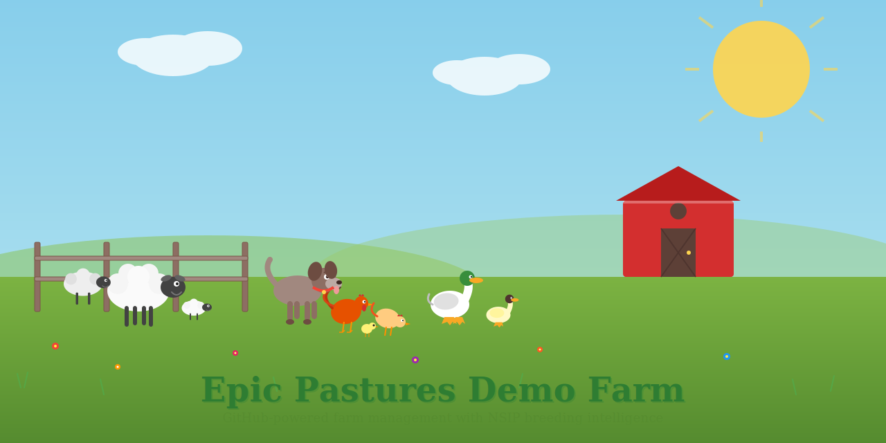
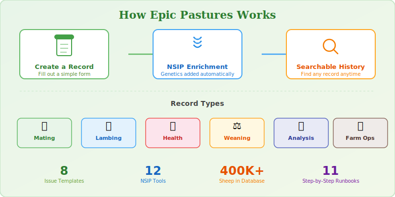

# Epic Pastures Demo Farm

<!-- Social Preview -->
<picture>
  <source media="(prefers-color-scheme: dark)" srcset=".github/social-preview-dark.svg">
  <source media="(prefers-color-scheme: light)" srcset=".github/social-preview.svg">
  
</picture>

Welcome to the Epic Pastures farm repository — your digital barn for all farm information.

This repository does three things:

1. **Organizes farm records** into easy-to-browse folders (crops, livestock, equipment, compliance, eov)
2. **Tracks sheep breeding** through a record-keeping system powered by the [National Sheep Improvement Program (NSIP)](https://nsip.org) genetic database
3. **Monitors ecological health** using the [Savory Institute's Ecological Outcome Verification (EOV)](https://savory.global/eov/) framework to track whether the land is regenerating

When you create a breeding record (mating, lambing, health, weaning), the system automatically looks up the animal's genetics and adds useful information like growth potential, inbreeding risk, and trait comparisons. When you create an ecological monitoring record (site assessment, soil sample, water test), it compares your observations to previous visits and tracks trends over time.

---

## Quick Links

| Section | What You'll Find |
|---------|-----------------|
| [Crops](./crops/) | Planting schedule, crop rotation, soil tests |
| [Livestock](./livestock/) | Health records, feeding schedule, vet log |
| [Equipment](./equipment/) | Maintenance log, safety inspections, inventory |
| [Compliance](./compliance/) | Grant tracking, certifications |
| [EOV](./eov/) | Ecological monitoring plan, site map, baseline data, outcome goals |

### Guides

| Guide | Description |
|-------|-------------|
| [User Guide](./docs/USER-GUIDE.md) | Start here — how to use this system (written for non-technical users) |
| [Runbooks](./docs/runbooks/) | Step-by-step instructions for common tasks |
| [Breeding Event Log](./docs/BREEDING-EVENT-LOG.md) | How the NSIP breeding record system works |

### Creating Records

Click the **Issues** tab above, then **New issue** to create a record. Available forms:

- **Mating Record** — Log a breeding pairing (auto-checks inbreeding risk)
- **Lambing Record** — Log a birth event
- **Health Record** — Log a health observation or treatment
- **Weaning Record** — Log weaning weights
- **Flock Action** — Request an automated flock analysis (compare, rank, mating recommendations)
- **EOV Site Assessment** — Score ecological health indicators at a monitoring site
- **EOV Soil Sample** — Record soil lab results
- **EOV Water Test** — Record a water infiltration test
- **EOV Photo Point** — Document a photo monitoring point
- **EOV Action** — Request an automated ecological analysis (seasonal summary, site comparison, trend report, enrollment readiness)
- **Crop Issue Report** — Report a field problem
- **Equipment Maintenance** — Report an equipment issue

---

## How It Works

<picture>
  
</picture>

---

## Automation

This repository uses [GitHub Actions](https://github.com/zircote/nsip-example/actions) workflows and the [NSIP MCP server](https://github.com/zircote/nsip) to automate farm operations.

### Workflows

| Workflow | Trigger | What It Does |
|----------|---------|--------------|
| **Flock Action** | Issue opened with `flock-action` label | Auto-assigns [Copilot coding agent](https://docs.github.com/en/copilot) to run the requested flock analysis and produce a report |
| **Weekly Farm Reminder** | Every Monday at 8:00 AM UTC | Creates a checklist issue with equipment, livestock, crop, and administrative tasks for the week |
| **Copilot Setup** | Manual (on-demand) | Installs the `nsip` CLI binary and pulls the NSIP Docker image for the Copilot agent environment |
| **EOV Enrichment** | Issue opened with `record:eov-*` or `eov-action` label | Auto-assigns Copilot to enrich ecological records with trend analysis |
| **EOV Seasonal Reminder** | Quarterly (Mar 1, Jun 1, Sep 1, Dec 1) | Creates a monitoring checklist issue with all sites and season-specific tips |
| **Dependabot Auto-Merge** | Dependabot PR opened | Automatically approves and merges dependency update PRs after CI passes |

### NSIP MCP Server

The [`.mcp.json`](.mcp.json) file configures a Docker-based [MCP](https://modelcontextprotocol.io) server that connects to the National Sheep Improvement Program database (400,000+ sheep). When a breeding record issue is created, the Copilot agent calls NSIP tools to enrich the record with genetic data:

| Tool | Purpose |
|------|---------|
| `search` | Find animals by name, ID, or flock |
| `details` / `profile` | Retrieve individual animal EBVs and indexes |
| `lineage` / `progeny` | Pedigree and offspring lookup |
| `compare` / `rank` | Side-by-side comparison or weighted ranking |
| `inbreeding_check` | Calculate coefficient of inbreeding for a pairing |
| `mating_recommendations` | Find optimal sires for a given dam |
| `trait_ranges` / `flock_summary` | Breed percentiles and aggregate flock statistics |

See [`.github/instructions/nsip-mcp.instructions.md`](.github/instructions/nsip-mcp.instructions.md) for the full tool reference.

---

## Ecological Outcome Verification (EOV)

This farm tracks ecological health using the [Savory Institute's EOV framework](https://savory.global/eov/) — an outcomes-based monitoring protocol used on over 6 million acres worldwide. Instead of just tracking what you do (practices), EOV measures what actually happens on the land (outcomes).

### What We Monitor

| Component | Method | Frequency |
|-----------|--------|-----------|
| **15 Ecological Health Indicators** | Visual assessment at 12 monitoring sites | Seasonal (4x/year) |
| **Soil Health** | Lab analysis (Haney/CASH tests) at 3 sites | Every 3-5 years |
| **Water Infiltration** | On-site ring test at 3 sites | Every 3-5 years |
| **Photo Points** | Repeat photography at all sites | Seasonal (4x/year) |

The 15 indicators cover plant community health (canopy cover, species composition, grasses, forbs), biological activity (living organisms, dung decomposition, litter breakdown), and soil stability (bare ground, capping, wind/water erosion).

### How It Works

1. **Walk a monitoring site** and create an **EOV Site Assessment** issue — score what you see
2. The system **converts scores to numbers** and calculates an Ecological Health Index (EHI)
3. **Trends are tracked automatically** — the system compares each visit to previous ones and flags changes
4. Request a **Seasonal Summary** or **Annual Trend Report** to see the big picture

See [eov/monitoring-plan.md](./eov/monitoring-plan.md) for the full monitoring plan and [eov/site-map.md](./eov/site-map.md) for site locations.

### Learn More About EOV

- [Savory Institute — EOV Overview](https://savory.global/eov/)
- [EOV Manual (Public)](https://savory-institute.gitbook.io/eov-manual-public)
- [Land to Market Program](https://www.landtomarket.com/eov)
- [Savory Institute](https://savory.global/)

---

## About This Farm

Epic Pastures is a 45-acre farm in Farmville, VA. We raise Katahdin hair sheep, chickens, ducks, and turkeys, and sell market garden produce and eggs seasonally.

**Contact:** hello@epicpastures.com

---

*This is a demo repository for [GitHub4Farms](https://github.com) training. All data is fictional.*
